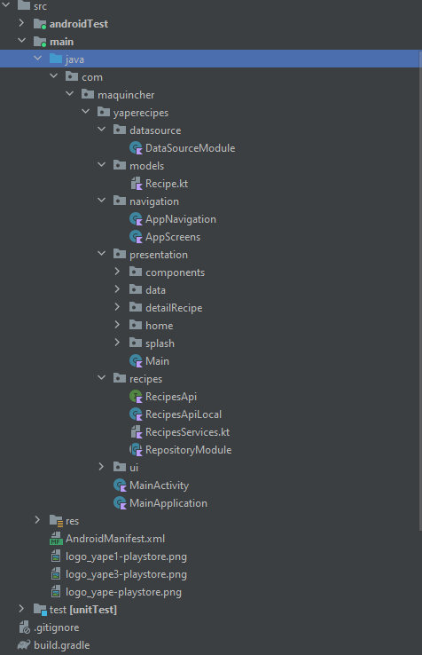
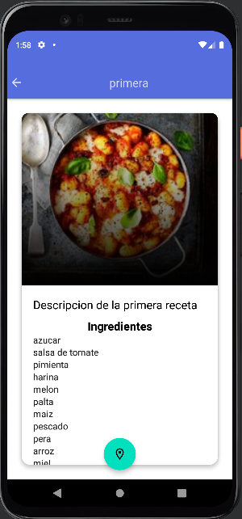
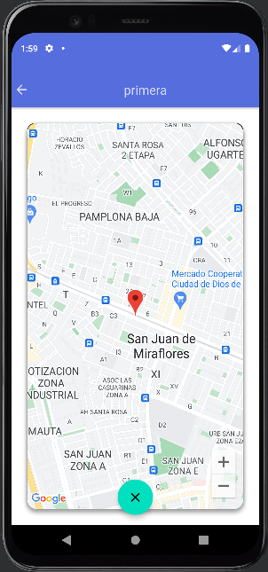

[](https://ktlint.github.io/)
[](https://developer.android.com/jetpack/compose)
[](https://kotlinlang.org/)
[](https://android-arsenal.com/api?level=28)
[](https://lv.binarybabel.org/catalog/gradle/latest)


<p align="center"> 
    
</p>

<h1 align="center"> Yape Recipes Android </h1>

Android Clean Architecture in Yape Recipes is a sample project that presents modern, approach to [Android](https://www.android.com/) application development using [Kotlin](https://kotlinlang.org/) and latest tech-stack.

El objetivo del proyecto es un challenges de Yape de BCP, que hizo una invitacion para demostrar las habilidades para desarrollar apps moviles
Tiene como requisito 3 pantallas
Lista y buscador de las recetas (Home Screen) 
Detalles de la receta seleccionada (Detail Screen) 
Mapa geolocalización de origen de la receta (Map Screen)


El proyecto esta creado con 
- Clean Architecture principalmente, separando cada capa y desacoplando funcionalidades y aplicando priuncipios SOLID
- Repository Pattern abstrayendo la capa de acceso de datos
- JetPack Compose, kit de herramientas moderno de Android para compilar IU nativas


## Environment Setup

Implementado con Android Studio Electric Eel 2022.1.1


### Project Structure
<p align="center"></p>


## Demo Screenshots

| Splash                                            |
|---------------------------------------------------|
| |

| Home                                 |
|--------------------------------------|
|  |


| Detalle                                 |
|-----------------------------------------|
|  |


| Home                                 |
|--------------------------------------|
|  |


# Tech Stacks
This project uses many of the popular libraries, plugins and tools of the android ecosystem.

- [Compose](https://developer.android.com/jetpack/compose)  
    - [Material](https://developer.android.com/jetpack/androidx/releases/compose-material) - Construccion de interfaces de usuario de Jetpack Compose con componentes de Material Design listos para usar.
    - [Foundation](https://developer.android.com/jetpack/androidx/releases/compose-foundation) - Escribir aplicaciones de Jetpack Compose con bloques de construcción listos para usar y ampliar la base para construir sus propias piezas del sistema de diseño.        
    - [Lifecycle-ViewModel](https://developer.android.com/jetpack/androidx/releases/lifecycle) - Acciones de performance en respuesta a un cambio en el estado del ciclo de vida de otro componente, como actividades y fragmentos.    
    - [Coil](https://coil-kt.github.io/coil/compose/) - Libreria para llamado asyncronico de imagenes.
  
  
- [Jetpack](https://developer.android.com/jetpack)    
    - [AndroidX](https://developer.android.com/jetpack/androidx) - ndroidX es una mejora significativa respecto de la biblioteca de compatibilidad de Android original, que ya no se actualiza. Los paquetes de androidx reemplazan por completo la biblioteca de compatibilidad, ya que proporcionan paridad de funciones y bibliotecas nuevas.
    - [Lifecycle](https://developer.android.com/topic/libraries/architecture/lifecycle) - El paquete androidx.lifecycle incluye interfaces y clases que te permiten compilar componentes optimizados para ciclos de vida; es decir, componentes que pueden ajustar automáticamente su comportamiento en función del estado actual del ciclo de vida de una actividad o un fragmento.
    - [ViewModel](https://developer.android.com/topic/libraries/architecture/viewmodel) - La clase ViewModel es una lógica empresarial o un contenedor de estado a nivel de pantalla.    

- [Dagger Hilt](https://dagger.dev/hilt/) - Dependency Injection library.  
- [Retrofit](https://square.github.io/retrofit/) - Retrofit es la clase a través de la cual sus interfaces API se convierten en objetos invocables. De forma predeterminada, Retrofit le proporcionará valores predeterminados optimos para su plataforma, pero permite la personalización.
- [Material Design](https://material.io/develop/android/docs/getting-started/) - Cree increíbles interfaces de usuario hermosas.
- [Coroutines](https://github.com/Kotlin/kotlinx.coroutines) - Compatibilidad con la biblioteca para corrutinas, proporciona el generador de corrutinas runBlocking utilizado en las pruebas.
- [livedata](https://developer.android.com/topic/libraries/architecture/livedata?hl=es-419) Es una clase de contenedor de datos observables. A diferencia de un observable regular, LiveData está optimizado para ciclos de vida, lo que significa que respeta el ciclo de vida de otros componentes de las apps, como actividades, fragmentos o servicios. Esta optimización garantiza que LiveData solo actualice observadores de componentes de apps que tienen un estado de ciclo de vida activo.
- [Google Maps](https://developer.android.com/topic/libraries/architecture/livedata?hl=es-419) Paquete de google para manejo de los mapas
  
- [Test](https://en.wikipedia.org/wiki/Unit_testing)

    - [Robolectric](http://robolectric.org/) - Running tests on an Android emulator or device is slow! Building, deploying, and launching the app often takes a minute or more. That’s no way to do TDD. There must be a better way.
    - [Mockk](https://mockk.io/) - A modern Mockk library for UnitTest.
    - [Turbine](https://github.com/cashapp/turbine) - Turbine is a small testing library for kotlinx.coroutines Flow.
    - [Truth](https://github.com/google/truth) - Truth makes your test assertions and failure messages more readable.
    - [Coroutine-Test](https://github.com/Kotlin/kotlinx.coroutines/tree/master/kotlinx-coroutines-test) - Provides testing utilities for effectively testing coroutines.
    - ...


### Code Analyze Tools
- [Ktlint](https://developer.android.com/studio/write/lint?hl=es-419) - ALa herramienta lint comprueba los archivos de origen de tu proyecto de Android en busca de posibles errores y para realizar mejoras relacionadas con la precisión, la seguridad, el rendimiento, la usabilidad, la accesibilidad y la internacionalización


1. Open an issue first to discuss what you would like to change.
2. Fork the Project
3. Create your feature branch (`git checkout -b feature/amazing-feature`)
4. Commit your changes (`git commit -m 'Add some amazing feature'`)
5. Push to the branch (`git push origin feature/amazing-feature`)
6. Open a pull request

Please make sure to update tests as appropriate.

## ✍️ Authors

<a href="https://www.linkedin.com/in/mesut-g-33b41030" target="_blank">
  
</a>

👤 **developersancho**

[](https://www.linkedin.com/in/mesut-g-33b41030/)
[](https://developersancho.medium.com/)

Feel free to ping me 😉

## License

```license
Copyright © 2022 - developersancho

Licensed under the Apache License, Version 2.0 (the "License");
you may not use this file except in compliance with the License.
You may obtain a copy of the License at

   http://www.apache.org/licenses/LICENSE-2.0

Unless required by applicable law or agreed to in writing, software
distributed under the License is distributed on an "AS IS" BASIS,
WITHOUT WARRANTIES OR CONDITIONS OF ANY KIND, either express or implied.
See the License for the specific language governing permissions and
limitations under the License.
```
